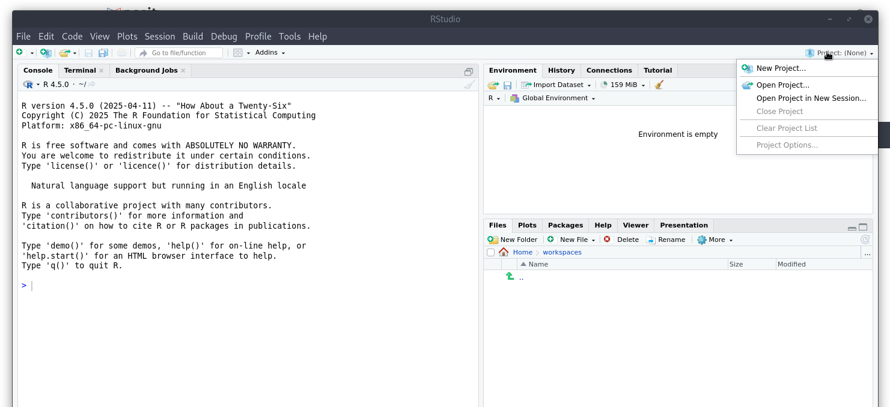
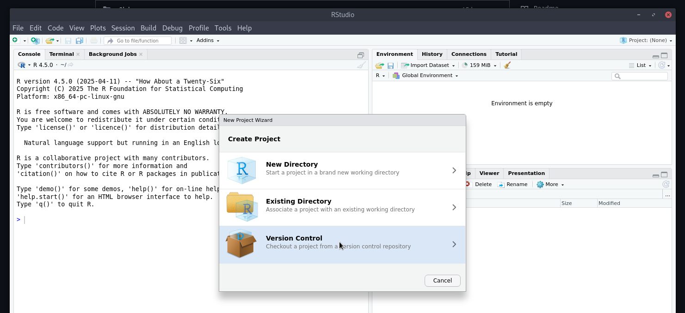
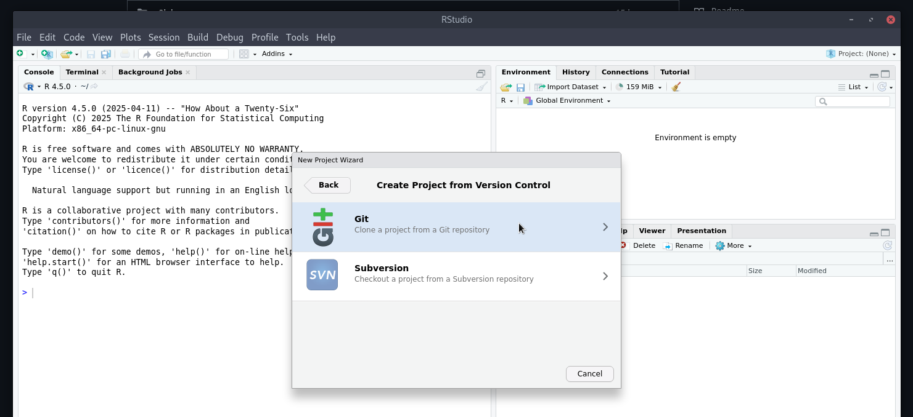
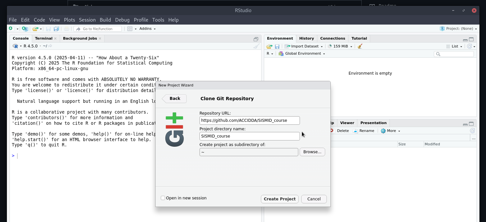

# R Tools for Rapid Outbreak Analytics

**Welcome to the course!**

We are excited to welcome you to the series of sessions

**Before the first session**, please ensure you have completed [the pre-course videos and readings on Canvas](https://canvas.instructure.com/courses/11724282), and that your [R environment is fully set up](#installation-and-setup).

**During the live sessions**, we will work through practical outbreak exercises using Quarto (`.qmd`) files, based on a simulated Ebola outbreak.

There is a `.qmd` file per lab session, named `lab_1.qmd`, `lab_2.qmd`, ... You should review the `.qmd` files and _attempt_ the exercises in advance. Certain exercises - those marked with the 🧠 symbol - we will collaboratively complete together during the sessions. 

If you have any questions ahead of the sessions on any of the materials, please post them on Canvas so we can address them during the live discussions. We have set up specific threads for each lab, as well as a general questions thread.

See you soon!

Carl, Cy, Degoot

# Installation and Setup

## R and RStudio 

For this workshop, we assume you are using [RStudio](https://posit.co/download/rstudio-desktop/) - please ensure you have RStudio (and by implication, R) available on the computer you are using for the course; follow the directions from Posit in that link to accomplish an install. We have tested this material using the latest version Rstudio and R, so we recommend you install or upgrade to those, but we understand you may have restrictions about what you are allowed to do on your machine.

## Get these files

To get all files relevant to the course, you can simply clone this repository. You should be able to use RStudio's project interface to do so (these screenshots might vary slightly from your interface):

1. create a new project: 
2. select the version control option: 
3. select the `git` option: 
4. enter the info for this repository, "https://github.com/ACCIDDA/SISMID_course": 

Alternatively, if you are generally familiar with `git`, feel free to use whatever approach you like to clone this repository.

## Install the Relevant Packages

In the R project you just created, open the `install_script.R` file. This contains all the packages that you will need for this course. There is one library, `sodium` which requires some steps outside R, but once you have done those, you can source this file to manage all the installation steps. Note: there is a lot to install, so expect this will take a bit.

If you need to more carefully manage your R environment, you may want to use a tool like `renv` or `pak` - feel free to use those tools.

If you are having issues with installation, please post in the Canvas Discussion board.

# Labs!

## Lab 1: Introduction and the Early Outbreak Phase

## Lab 2: The Intermediate Outbreak Phase

## Lab 3 & 4: A Specific Application in the Late Phase: `outbreaker2`

This two-part lab focuses on outbreak reconstruction using the `outbreaker2` package.
